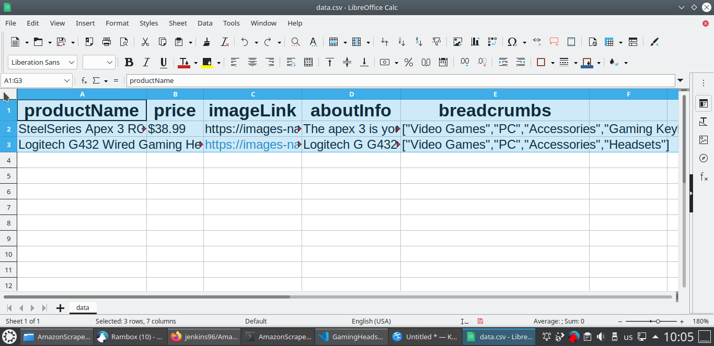
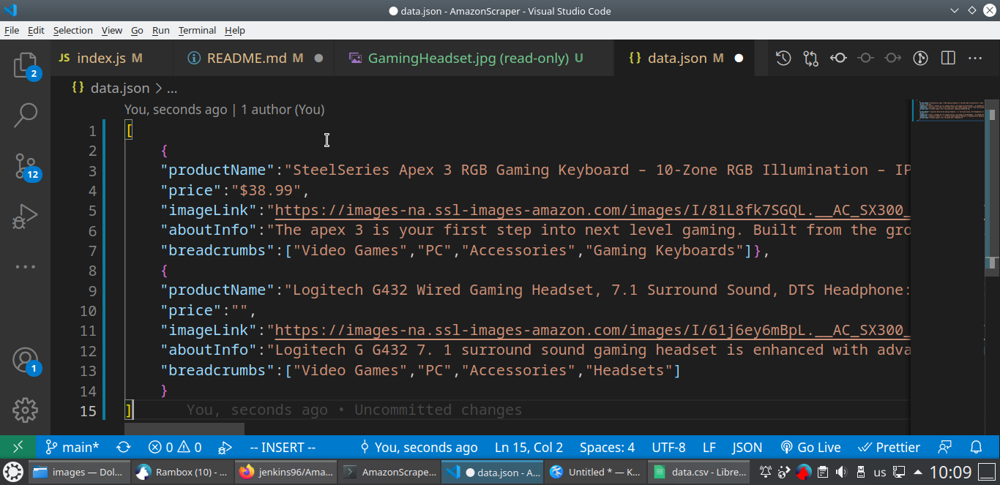

<br/>
<p align="center">
  <a href="https://github.com/jenkins96/AmazonWebScraper">
    
  </a>

  <h3 align="center">Amazon Web Scraper</h3>

  <p align="center">
    Every Project Teach Us Something!
    <br/>
    <br/>
    <a href="https://github.com/jenkins96/AmazonWebScraper"><strong>Explore the docs »</strong></a>
    <br/>
    <br/>
  </p>
</p>

 

## Table Of Contents

* [About the Project](#about-the-project)
* [Built With](#built-with)
* [Prerequisites](#prerequisites)
* [Installation](#installation)
* [Usage](#usage)
* [Author](#author)


## About The Project




Simple web scraper for Amazon website.  
It will create a '.json' and a '.csv' file filled with the data defined from the 'URLS' variable.  
In addition, it will save the image of the products in: './images/id.jpg'.
## Built With

* Node.js
* JavaScript
* NPM:
  * "cheerio": Implementation of core jQuery designed specifically for the server.
  * "json2csv": Converts json into csv
  * "request-promise": Simplified HTTP request client 'request' with Promise support (deprecated).
  * "image-downloader": Node module for downloading image to disk from a given URL.


### Prerequisites

This is an example of how to list things you need to use the software and how to install them.

* npm

```sh
npm install npm@latest -g
```

### Installation

1. Clone the repo

```sh
git clone https://github.com/jenkins96/AmazonWebScraper.git
```

2. Install NPM packages

```sh
npm install
```

3. Run the script

```sh
node index.js
```

## Usage

Add as many links as you want to the 'URLS' variable. As long as Amazon do not change its HTML structure it is suppossed to work.


## Author

* **Adrián Jenkins** - ** - [Adrián Jenkins](https://github.com/jenkins96) - **

